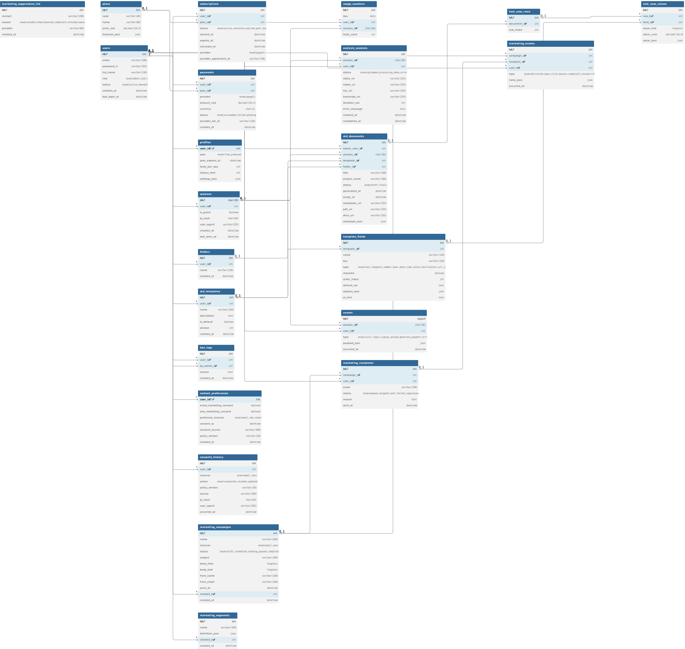

# STDone

Video → Test Doc

Generate Software Test Documents (STD) automatically from testing videos. Upload a recording of a manual test session (optionally with rrweb events, console logs, and HAR), and STDone extracts steps, expected/actual behavior, severity, and produces a clean, exportable test document.

---

## Table of Contents

* [Features](#features)
* [How It Works](#how-it-works)
* [Tech Stack](#tech-stack)
* [Dynamic Test Case Columns](#dynamic-test-case-columns)
* [Privacy & Data](#privacy--data)

---

## Features

* Video to STD: upload a session video and get a structured test document (Markdown, PDF, DOCX).
* AI extraction: speech-to-text (Whisper), keyframes with OCR, optional rrweb/HAR merge for steps and evidence.
* Dynamic templates: choose which columns your Test Cases table has (Title, Steps, Expected, Actual, Severity, Tags, custom fields).
* Accounts and quotas:

  * Guest: up to 3 reports per day, no history (session-only).
  * Free user: 3 reports per day, history of last 10.
  * Premium: unlimited reports and history, folders to organize documents.
* Admin: block users, view analytics (visits, signups, subscriptions, generated documents per month/year).
* Privacy-ready: consent and suppression lists for marketing messages.

---

## How It Works

1. Upload a video (MP4/MOV). Optional: rrweb JSON, HAR, console logs.
2. Processing: FFmpeg extracts audio; Whisper ASR produces a transcript; keyframe clustering and OCR capture on-screen text; all signals can be merged with rrweb/HAR.
3. AI generates scenarios and test cases, suggests severity, and fills dynamic template fields. Uncertain fields get a clear fallback value.
4. Rendering: output to Markdown, export to PDF/DOCX, and store document with evidence links.

---

## Tech Stack

* Backend: FastAPI (Python), Celery or RQ for background jobs.
* AI/ML: Whisper (ASR), OpenCV and OCR, LLM for drafting cases based on prompt templates.
* Database: MySQL 8 (ERD in `/docs/erd.dbml`), object storage (local or S3).
* Frontend: React with Vite (upload UI, history, folders).

ERD and DBML live in `/docs`. The schema covers accounts and usage, analysis sessions, dynamic templates, documents, analytics, and marketing consent.

---

## Dynamic Test Case Columns

Templates define the columns in your test table (for example: Title, Preconditions, Steps, Expected, Actual, Severity, Component, Evidence, Tags). Each field has a `type` and an optional `ai_hint`. The AI uses hints and extracted signals to fill values; unknown fields fall back to a neutral value such as "Not detected" or "Needs review".

---

## Privacy & Data

* Guests: no persistent history; documents exist only for the active browser session unless saved by signing up.
* Free: history shows the last 10 documents.
* Premium: unlimited history and folders.
* Admin can block users and see usage analytics. Marketing requires explicit consent (opt‑in) and respects suppression lists.

---

## Database ERD

  

Source (DBML): [docs/erd.dbml](docs/erd.dbml) · MySQL DDL: [docs/schema.mysql.sql](docs/schema.mysql.sql)
